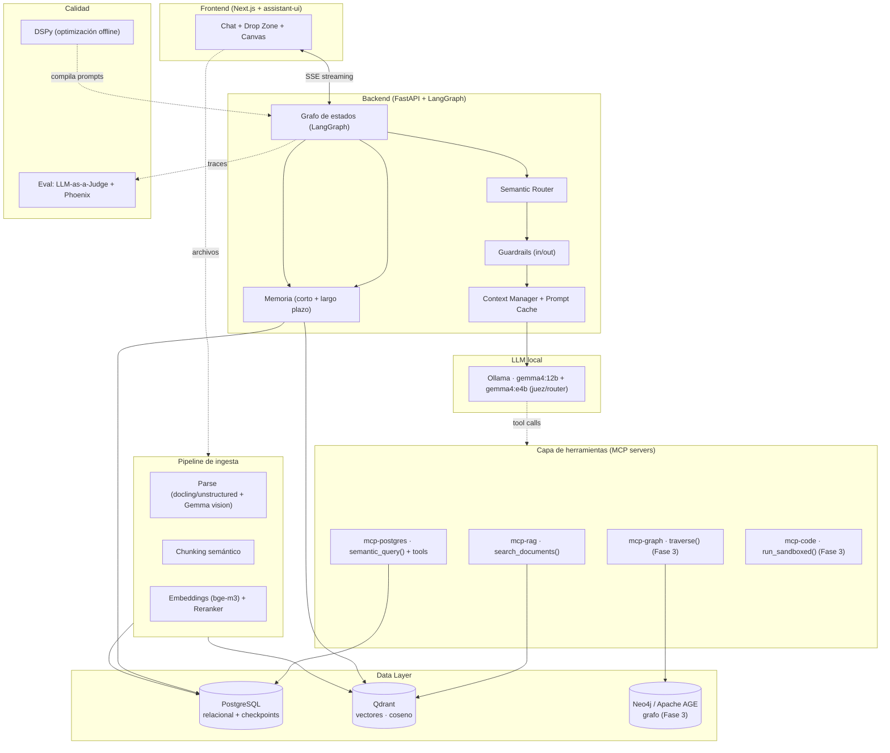

# Praxia — Blueprint Técnico End-to-End

> **El copiloto agéntico para prácticas profesionales basadas en la atención.**
> Un CRM conversacional donde el personal administrativo *habla* con sus datos y *arrastra* sus documentos, en lugar de pelear con formularios.

**Versión del documento:** 1.0 · **Fecha:** 4 de junio de 2026
**Naturaleza:** Proyecto de portfolio de alto impacto para perfil *AI Lead / AI Solutions Architect*
**Restricciones de diseño:** Costo \$0 (solo tiers gratuitos / self-hosting) · No reinventar la rueda (modelos y librerías existentes) · Privacidad por defecto (inferencia local)

---

## 0. Resumen ejecutivo

**Praxia** es un sistema de gestión de clientes (CRM) diseñado **exclusivamente para negocios de servicios de atención 1-a-1** —clínicas médicas, consultorios odontológicos, psicólogos, kinesiólogos, profesores particulares, estudios jurídicos— donde el activo no es un catálogo de productos sino el **vínculo con cada cliente y el historial de interacciones**.

La tesis del producto es simple y fuerte: **el personal administrativo de estos negocios pierde horas en software rígido**. Praxia elimina esa fricción reemplazando la UI tradicional por dos primitivas:

1. **Lenguaje natural** ("agendá un control para Ana en dos semanas con la Dra. Gómez", "¿cuántas ausencias tuvimos este mes?", "resumime la última sesión de Juan").
2. **Drag & drop** de archivos (PDF, DOCX, MD, imágenes escaneadas, audios de consulta) que se procesan, indexan y conectan al cliente correcto automáticamente.

Detrás de esa simplicidad hay un **sistema multi-agente orquestado como máquina de estados (LangGraph)** sobre **Gemma 4 corriendo 100% en local**, con **Agentic RAG vía MCP**, **NLP-to-SQL con capa semántica**, **memoria de largo plazo**, **guardrails**, **evaluación con LLM-as-a-Judge** y **prompts optimizados con DSPy**.

### Por qué este proyecto impresiona a un AI Lead
No es un "chatbot con RAG". Es la demostración de que sabés **ensamblar un sistema de IA de producción** y razonar sobre sus *trade-offs*:

| Competencia senior | Cómo la demuestra Praxia |
|---|---|
| Arquitectura de sistemas agénticos | Grafo de estados tipado, routing semántico, subgrafos especializados, human-in-the-loop |
| Ingeniería de datos para IA | Doble *data layer* (relacional + vectorial), capa semántica, pipeline de ingesta multimodal |
| Confiabilidad de LLMs locales | Decodificación restringida, jueces, *retries*, DSPy contra métricas reales |
| Privacidad y cumplimiento | Inferencia local (cero datos sensibles fuera de la máquina), PII redaction, audit log |
| Evaluación rigurosa | *Golden set*, métricas de groundedness y *execution accuracy*, gates en CI |
| Pragmatismo de costos | Stack íntegramente \$0, decisiones explícitas de *self-host vs. free tier* |

---

## 1. El stack confirmado (estado a junio 2026)

Antes de diseñar, se validó el componente más volátil del stack: **Gemma 4**.

- **Gemma 4** es la familia de modelos abiertos de Google DeepMind lanzada el **2 de abril de 2026** bajo licencia **Apache 2.0** (uso comercial libre), con tamaños **E2B, E4B, 26B-A4B (MoE) y 31B (denso)**, ventana de contexto de **hasta 256K tokens** y soporte multilingüe (140+ idiomas, incluido español).
- **Gemma 4 12B** se lanzó el **3 de junio de 2026**: multimodal *encoder-free* (texto, imagen, audio, video sin codificadores separados), corre en laptops con **~16 GB de RAM/VRAM**, trae **Multi-Token Prediction (MTP)** por defecto para baja latencia y soporta **function calling / tool calling** nativo. Es **el modelo ideal para Praxia**: suficientemente capaz para razonar y usar herramientas, suficientemente liviano para self-host \$0.
- **Serving local**: `ollama pull gemma4:12b` (endpoint OpenAI-compatible en `localhost:11434`). **Importante:** el *tool calling* de Gemma 4 en Ollama requiere **Ollama ≥ v0.20.2**. Alternativas: **llama.cpp** (GGUF de Unsloth + archivo `mmproj` para multimodal) y **vLLM** (mayor *throughput* + *automatic prefix caching* para producción).

> **Caveat de ingeniería (honestidad técnica):** un modelo local de 12B es **menos confiable en *tool calling* que los modelos frontier**. Praxia compensa esto por diseño: decodificación restringida (JSON Schema), jueces de validación, *retries* y prompts optimizados con DSPy. Esto no es un parche, es parte de la arquitectura y de lo que hace al proyecto interesante.

---

## 2. El producto: Praxia en profundidad

### 2.1 Para quién (personas)
- **Recepcionista / administrativo** (usuario primario): agenda turnos, registra interacciones, sube documentos, responde "¿quién viene hoy?".
- **Profesional** (médico/psicólogo/profesor): pide resúmenes de historiales, dicta notas de sesión por voz, consulta evolución de un cliente.
- **Dueño/gerente de la práctica**: pide reportes ("ingresos del mes por profesional", "tasa de ausentismo", "clientes inactivos hace 90 días").

### 2.2 La experiencia (UX NLP-first)
La pantalla principal tiene tres zonas:

```
┌───────────────────────────────────────────────────────────────┐
│  PRAXIA                                         [Práctica ▾]    │
├──────────────────────────┬────────────────────────────────────┤
│                          │                                     │
│   💬  Chat conversacional │   🖼️  Canvas de resultados         │
│   (historial + streaming)│   (tablas, fichas de cliente,       │
│                          │    tarjetas de turno, gráficos,     │
│   ┌────────────────────┐ │    vista previa de documentos,      │
│   │  Soltá archivos     │ │    confirmaciones de acciones)     │
│   │  aquí (drag & drop) │ │                                     │
│   └────────────────────┘ │                                     │
│                          │                                     │
└──────────────────────────┴────────────────────────────────────┘
```

- **Todo es conversación.** No hay menús de 8 niveles. El usuario escribe o habla.
- **Drag & drop universal.** Soltás un PDF de un estudio, un DOCX de informe, un MD de notas o un audio de consulta; Praxia lo parsea, lo asocia al cliente correcto (o te pregunta si hay ambigüedad) y lo indexa.
- **Acciones con confirmación (human-in-the-loop).** Toda operación que *escribe* datos (crear/reprogramar turno, registrar interacción, emitir factura) se previsualiza y requiere confirmación: *"Voy a crear el turno del martes 10:00 con la Dra. Gómez para Ana López. ¿Confirmás?"* → botón **Confirmar / Editar / Cancelar**.

### 2.3 Tres flujos de ejemplo (end-to-end)

**Flujo A — Consulta de datos (NLP-to-SQL):**
> Usuario: *"¿Cuántos turnos ausentes tuvimos en mayo y qué profesional tuvo más?"*
> → Router clasifica intención = `consulta_estructurada` → Data Agent consulta la capa semántica → genera SQL `SELECT` validado → ejecuta (read-only) → juez verifica que el SQL responde a la intención → render de tabla + frase en lenguaje natural en el canvas.

**Flujo B — Pregunta sobre documentos (Agentic RAG):**
> Usuario: *"¿Qué decía el último informe psicológico de Martín sobre el sueño?"*
> → Router → intención = `consulta_documental` → Agentic RAG recupera (coseno + rerank) los chunks del cliente Martín → juez de relevancia (CRAG) → si insuficiente, reformula y reintenta → síntesis con citas → juez de *groundedness* (anti-alucinación) → respuesta con referencias al documento y página.

**Flujo C — Ingesta + acción (multimodal + write):**
> Usuario arrastra un PDF escaneado y dice *"esto es el último estudio de Juan, agendá control en 15 días"*.
> → Pipeline de ingesta (Gemma 4 vision lee el escaneo) → indexa → asocia a Juan → planner (Plan-and-Solve) descompone: (1) confirmar indexación, (2) proponer turno → human-in-the-loop confirma → escribe `appointment` + `interaction`.

---

## 3. Arquitectura de alto nivel

### 3.1 Diagrama del sistema



### 3.2 El grafo de estados (LangGraph)

```mermaid
flowchart TD
    START([Entrada del usuario]) --> G_IN{Guardrails<br/>entrada}
    G_IN -->|bloqueado| ABSTAIN[Respuesta segura / rechazo]
    G_IN -->|ok| ROUTE[Semantic Router]

    ROUTE -->|saludo / fuera de alcance| CHITCHAT[Respuesta directa]
    ROUTE -->|consulta estructurada| SQLAGENT[Data Agent · ReAct]
    ROUTE -->|consulta documental| RAGAGENT[Agentic RAG · CRAG]
    ROUTE -->|relacional / multi-hop| GRAPHAGENT[GraphRAG · Fase 3]
    ROUTE -->|acción write| PLANNER[Planner · Plan-and-Solve]
    ROUTE -->|analítica ad-hoc| CODEAGENT[Code Agent · sandbox · Fase 3]

    subgraph RAG["Subgrafo Agentic RAG"]
        RAGAGENT --> RETRIEVE[Retrieve coseno + rerank]
        RETRIEVE --> GRADE{Juez relevancia}
        GRADE -->|insuficiente| REWRITE[Reformular query]
        REWRITE --> RETRIEVE
        GRADE -->|ok| SYNTH[Síntesis con citas]
    end

    SQLAGENT --> SQLCHECK{Juez intención SQL}
    SQLCHECK -->|no coincide| SQLAGENT
    SQLCHECK -->|ok| SQLRUN[Ejecutar SELECT read-only]

    PLANNER --> CONFIRM{Human-in-the-loop<br/>(interrupt)}
    CONFIRM -->|confirmado| WRITE[Tools parametrizadas: create/update]
    CONFIRM -->|cancelado| ABSTAIN

    SYNTH --> G_OUT{Guardrails salida +<br/>juez groundedness}
    SQLRUN --> G_OUT
    WRITE --> G_OUT
    CHITCHAT --> G_OUT
    G_OUT -->|ok| REFLECT[Actualizar memoria]
    G_OUT -->|alucinación / inseguro| ABSTAIN
    REFLECT --> END([Respuesta + render en canvas])
```

**Estado tipado del grafo** (resumen):

```python
from typing import TypedDict, Annotated, Literal
from langgraph.graph.message import add_messages

class AgentState(TypedDict):
    messages: Annotated[list, add_messages]   # historial (con reductor)
    thread_id: str                            # = sesión
    practice_id: str                          # tenant (multi-tenant + RLS)
    user_id: str
    intent: Literal["sql", "rag", "graph", "action", "code", "chitchat"]
    plan: list[str]                           # Plan-and-Solve
    retrieved: list[dict]                     # chunks recuperados
    candidate_sql: str | None
    proposed_action: dict | None              # para human-in-the-loop
    judge_scores: dict                        # groundedness, relevancia, etc.
    memories: list[dict]                      # memoria semántica recuperada
    running_summary: str                      # gestión de contexto
```

La **persistencia** del estado usa el **checkpointer de Postgres** (`langgraph-checkpoint-postgres`), lo que da **gestión de sesiones** y **memoria de corto plazo** "gratis": cada `thread_id` reanuda exactamente donde quedó, incluso tras un `interrupt` de confirmación.

---

## 4. Justificación del stack: cómo se luce cada pieza

Esta sección mapea **cada capacidad solicitada** a un componente concreto y explica *dónde brilla*.

### 4.1 Tabla maestra de decisiones (todo \$0)

| Capa | Tecnología elegida | Por qué / dónde brilla | Fuente \$0 |
|---|---|---|---|
| **LLM** | Gemma 4 12B (`gemma4:12b`) + `gemma4:e4b` para tareas baratas | Local, Apache 2.0, multimodal, 256K ctx, tool calling | Ollama / HF / Kaggle |
| **Serving** | Ollama (prod: vLLM) | OpenAI-compatible, *prefix caching*, fácil | Self-host |
| **Orquestación** | LangGraph (grafos) + LangChain (componentes) | Máquina de estados, *checkpointing*, *interrupts*, streaming | OSS |
| **Routing** | Router semántico (coseno) + clasificador `e4b` | Decide subgrafo sin gastar el 12B | OSS |
| **Herramientas** | MCP servers + `langchain-mcp-adapters` | Desacopla tools del agente; estándar | OSS |
| **RAG** | Qdrant (coseno) + `bge-m3` + reranker `bge-reranker-v2-m3` | Recuperación multilingüe + precisión | Qdrant local |
| **Relacional** | PostgreSQL | Fuente de verdad, NLP-to-SQL, RLS multi-tenant | Supabase/Neon free o Docker |
| **Capa semántica** | YAML de métricas/dimensiones + Data Agent | Traduce negocio→SQL de forma segura | OSS / propio |
| **Embeddings** | Sentence-Transformers `bge-m3` | Pre-entrenado, español, denso+sparse | HF, local |
| **Parsing docs** | `docling`/`unstructured` + Gemma 4 vision | PDF/DOCX/MD + escaneos/audio | OSS / modelo local |
| **Memoria largo plazo** | Qdrant (`memories`) + tabla Postgres + reflexión | Recuerda preferencias y hechos por cliente/práctica | OSS |
| **Caching** | Prefijo estable (KV cache) + semantic cache + cache de embeddings | Baja latencia y cómputo en local | OSS |
| **Eval** | LLM-as-a-Judge (Gemma `e4b`) + Ragas + Phoenix | Groundedness, *execution accuracy*, trazas | OSS |
| **Guardrails** | Presidio (PII) + `llm-guard` + Outlines/Instructor | PII, inyección, salida estructurada válida | OSS |
| **DSPy** | `MIPROv2` / `GEPA` sobre LM local | Compila prompts contra métricas reales | OSS |
| **GraphRAG** | Neo4j Community / Apache AGE | Preguntas relacionales multi-hop | OSS / extensión PG |
| **Code Interpreter** | Python en sandbox (Docker + nsjail / Pyodide) | Analítica ad-hoc sin riesgo | OSS |
| **Frontend** | Next.js + assistant-ui / CopilotKit | Chat streaming + render de tool calls + drop zone | Vercel free / local |

### 4.2 Cómo brilla cada concepto del brief

- **RAG / Agentic RAG / GraphRAG.** Tres niveles deliberados: RAG plano (coseno+rerank) como base; **Agentic RAG correctivo (CRAG)** como un subgrafo que *evalúa la relevancia de lo recuperado, reformula y reintenta* (ReAct); **GraphRAG** para preguntas que el texto plano no resuelve bien ("¿qué pacientes derivados por el Dr. X tienen seguimientos pendientes sobre la condición Y?").
- **MCP + Function Calling.** Las herramientas viven como **servidores MCP** (`mcp-rag`, `mcp-postgres`, `mcp-graph`, `mcp-code`). Gemma 4 las invoca por *function calling*; LangGraph actúa de *MCP client* vía `langchain-mcp-adapters`. Esto demuestra el patrón moderno de desacoplar capacidades del agente y el *harness* de ejecución que el LLM local necesita.
- **Semantic Routing.** Nodo de entrada que mide **similitud coseno** de la consulta contra ejemplos de cada intención; ante duda, un **clasificador `gemma4:e4b`** (barato) desempata. El mismo coseno que potencia el RAG potencia el router.
- **Patrones de razonamiento.** **ReAct** en los agentes que usan tools (RAG, SQL). **Plan-and-Solve** en el planner para requests multi-paso. **Tree of Thoughts** reservado al *Insights Agent* (Fase 3) para explorar hipótesis ("¿por qué subió el ausentismo?") — usado con moderación por su costo en un 12B local.
- **NLP-to-SQL + Data Agents + Semantic Layer.** El Data Agent no escribe SQL "a ciegas": consulta una **capa semántica** (métricas/dimensiones/sinónimos en YAML) + el esquema introspectado, genera SQL `SELECT`, lo **valida y explica antes de ejecutar**, y un juez verifica que responde a la intención. Las *escrituras* nunca son SQL libre: son **tools parametrizadas** con confirmación.
- **Memoria semántica y de largo plazo.** Tras cada interacción relevante, un **paso de reflexión** resume hechos/preferencias y los guarda en `memories` (Qdrant + Postgres). Se recuperan por coseno e inyectan en contexto: Praxia aprende que la práctica dice "pacientes" (no "clientes"), que la Dra. Gómez no atiende viernes, que turnos son de 30 min.
- **Gestión de contexto y prompt caching.** Un *Context Manager* arma el prompt con presupuesto de tokens: **prefijo estable** (system + esquema + glosario + reglas de guardrails) que aprovecha el **KV/prefix cache** del runtime; **resumen incremental** de turnos viejos; top-k de chunks tras rerank; memorias relevantes. Además **semantic cache** (coseno sobre Q→A pasadas) para cortocircuitar preguntas repetidas y **cache de embeddings** para no re-embeber documentos sin cambios.
- **Gestión de sesiones.** `thread_id` + checkpointer de Postgres = reanudación exacta, soporte de *interrupts* y aislamiento por usuario/tenant.
- **Agentic Evaluation (LLM-as-a-Judge).** Doble pista: **online** (jueces dentro del grafo: relevancia de retrieval, *groundedness* anti-alucinación, coincidencia SQL↔intención) y **offline** (*golden set* + métricas tipo Ragas + trazas en Phoenix, como *gate* de CI). El juez corre en `e4b` para ahorrar cómputo.
- **Guardrails y moderación.** Entrada: **PII redaction (Presidio, español)** —crítico para datos de salud—, detección de inyección de prompt, *scope guardrail* (el router rechaza fuera de alcance). Salida: **decodificación restringida (Outlines/Instructor o JSON Schema de Ollama)** para que los *tool calls* y respuestas estructuradas sean siempre JSON válido (mitiga la fragilidad del 12B), chequeo de *groundedness* y de toxicidad. Privacidad: **inferencia 100% local** (ningún dato sensible sale de la máquina) + *audit log* + flags de consentimiento.
- **Optimización algorítmica de prompts (DSPy).** Los módulos de mayor apalancamiento (SQL, síntesis RAG, router, jueces) se definen como `dspy.Signature` y se **compilan con `MIPROv2`/`GEPA`** contra el *golden set*, usando como métrica el propio juez / *execution accuracy*. El LM de DSPy apunta al Ollama local (\$0). Resultado: *few-shots* e instrucciones optimizadas, no escritas a mano.
- **Code Interpreter y Sandboxing.** Para analítica que la capa semántica no expresa, un **Code Agent** genera Python y lo ejecuta en **sandbox** (contenedor Docker efímero con `nsjail`/seccomp, **sin red**, FS de solo lectura, límites de CPU/memoria/tiempo, *allow-list* de librerías: pandas/matplotlib/numpy). Recibe un *export* de solo lectura o el resultado parametrizado de una query y devuelve un gráfico/tabla.
- **Procesamiento PDF/DOCX/MD (+ multimodal).** `docling`/`unstructured` para parseo *layout-aware*; para **escaneos/handwriting/imágenes** y **audios de consulta**, se aprovecha que **Gemma 4 12B es multimodal nativo** (lee imágenes y transcribe audio). Acá brilla la elección del modelo.
- **Frontend funcional.** Chat con *streaming* (SSE desde LangGraph), render de *tool calls* y resultados en el canvas (tablas, fichas, gráficos, vista previa de docs), drop zone global y tarjetas de confirmación para *human-in-the-loop*.

---

## 5. Data Strategy

### 5.1 Documentos para el RAG (taxonomía `doc_type`)

El corpus se organiza en **dos familias**: documentos **por cliente** (sensibles, gobiernan el RAG documental) y documentos **operativos/de conocimiento** (compartidos por la práctica).

**A) Por cliente (vinculados a `client_id`):**
| `doc_type` | Ejemplos | Uso en RAG |
|---|---|---|
| `historia_clinica` | Historia clínica / ficha del paciente | Contexto longitudinal del cliente |
| `nota_sesion` | Notas de evolución, formato SOAP | "Resumime las últimas 3 sesiones" |
| `informe` | Informe psicológico / odontológico / de progreso del alumno | Preguntas sobre diagnósticos/avances |
| `estudio` | Laboratorio, imágenes, estudios (PDF/escaneo) | "¿Qué decía el último estudio?" |
| `receta` | Recetas / indicaciones | Historial de indicaciones |
| `consentimiento` | Consentimiento informado firmado | Verificación de consentimiento + RAG |
| `comunicacion` | Emails, resúmenes de llamadas, mensajes | Contexto de contacto |

**B) Operativos / conocimiento (vinculados a `practice_id`):**
| `doc_type` | Ejemplos | Uso en RAG |
|---|---|---|
| `protocolo` | Protocolos de atención, guías clínicas | "¿Cuál es el protocolo para primera consulta?" |
| `politica` | Cancelaciones, honorarios, reglas internas | "¿Cuánto se cobra por ausencia?" |
| `plantilla` | Plantillas de informe / consentimiento | Generación asistida de documentos |
| `glosario` | Glosario/vademécum, terminología de la práctica | Mejora el routing y la capa semántica |
| `faq` | Preguntas frecuentes internas | Onboarding del personal |

> **Dataset \$0 para el demo:** los datos de salud reales **no se pueden usar**. Se generan **datos sintéticos** con Faker + el propio Gemma 4 (historias, notas, informes ficticios coherentes) y protocolos/políticas de ejemplo. Esto, además, es un *argumento de privacidad* del proyecto.

**Pipeline de cada documento:** `drop → detectar tipo/MIME → parsear (docling/unstructured o Gemma vision si es escaneo/audio) → PII scan (Presidio) → chunking semántico → embeddings (bge-m3) → upsert en Qdrant {document_id, practice_id, client_id, doc_type, fecha, página} → fila en Postgres documents (status=indexado)`.

### 5.2 Esquema de PostgreSQL (DDL)

> Convención: cada tabla con datos de negocio lleva `practice_id` para **multi-tenant + Row-Level Security (RLS)**. PII (clientes) candidata a cifrado en reposo. Las tablas de *checkpoints* las crea LangGraph automáticamente; aquí va el esquema de negocio.

```sql
-- ====== Extensiones (si se usa pgvector como alternativa a Qdrant) ======
-- CREATE EXTENSION IF NOT EXISTS vector;        -- opción pgvector
-- CREATE EXTENSION IF NOT EXISTS age;            -- opción GraphRAG en Postgres (Fase 3)

-- ====== Tenant / práctica ======
CREATE TABLE practices (
    id           UUID PRIMARY KEY DEFAULT gen_random_uuid(),
    name         TEXT NOT NULL,
    type         TEXT NOT NULL CHECK (type IN ('clinica','odontologia','psicologia','tutoria','legal','otro')),
    settings     JSONB DEFAULT '{}'::jsonb,      -- ej: duración de turno, vocabulario, zona horaria
    created_at   TIMESTAMPTZ NOT NULL DEFAULT now()
);

-- ====== Usuarios (personal administrativo / profesional) ======
CREATE TABLE users (
    id           UUID PRIMARY KEY DEFAULT gen_random_uuid(),
    practice_id  UUID NOT NULL REFERENCES practices(id) ON DELETE CASCADE,
    full_name    TEXT NOT NULL,
    email        TEXT UNIQUE NOT NULL,
    role         TEXT NOT NULL CHECK (role IN ('admin','profesional','owner')),
    created_at   TIMESTAMPTZ NOT NULL DEFAULT now()
);

-- ====== Profesionales (quien presta el servicio) ======
CREATE TABLE practitioners (
    id            UUID PRIMARY KEY DEFAULT gen_random_uuid(),
    practice_id   UUID NOT NULL REFERENCES practices(id) ON DELETE CASCADE,
    user_id       UUID REFERENCES users(id),
    full_name     TEXT NOT NULL,
    speciality    TEXT,
    working_hours JSONB DEFAULT '{}'::jsonb,      -- ej: {"mon":[["09:00","17:00"]], "fri":[]}
    active        BOOLEAN NOT NULL DEFAULT true
);

-- ====== Clientes / pacientes / alumnos (PII) ======
CREATE TABLE clients (
    id           UUID PRIMARY KEY DEFAULT gen_random_uuid(),
    practice_id  UUID NOT NULL REFERENCES practices(id) ON DELETE CASCADE,
    full_name    TEXT NOT NULL,
    dob          DATE,
    email        TEXT,
    phone        TEXT,
    tags         JSONB DEFAULT '[]'::jsonb,       -- ej: ["primera_vez","obra_social_X"]
    status       TEXT NOT NULL DEFAULT 'activo' CHECK (status IN ('activo','inactivo','baja')),
    notes        TEXT,
    created_at   TIMESTAMPTZ NOT NULL DEFAULT now()
);
CREATE INDEX idx_clients_practice ON clients(practice_id);
CREATE INDEX idx_clients_name ON clients(practice_id, lower(full_name));

-- ====== Consentimientos (privacidad / cumplimiento) ======
CREATE TABLE consents (
    id           UUID PRIMARY KEY DEFAULT gen_random_uuid(),
    client_id    UUID NOT NULL REFERENCES clients(id) ON DELETE CASCADE,
    type         TEXT NOT NULL,                   -- ej: 'tratamiento_datos', 'grabacion_audio'
    granted      BOOLEAN NOT NULL DEFAULT false,
    scope        TEXT,
    document_id  UUID,                            -- FK a documents (consentimiento firmado)
    granted_at   TIMESTAMPTZ
);

-- ====== Turnos / citas ======
CREATE TABLE appointments (
    id             UUID PRIMARY KEY DEFAULT gen_random_uuid(),
    practice_id    UUID NOT NULL REFERENCES practices(id) ON DELETE CASCADE,
    client_id      UUID NOT NULL REFERENCES clients(id) ON DELETE CASCADE,
    practitioner_id UUID NOT NULL REFERENCES practitioners(id),
    start_at       TIMESTAMPTZ NOT NULL,
    end_at         TIMESTAMPTZ NOT NULL,
    status         TEXT NOT NULL DEFAULT 'programado'
                   CHECK (status IN ('programado','confirmado','atendido','ausente','cancelado')),
    reason         TEXT,
    channel        TEXT,                           -- 'presencial' | 'telellamada'
    created_by     UUID REFERENCES users(id),
    created_at     TIMESTAMPTZ NOT NULL DEFAULT now()
);
CREATE INDEX idx_appt_practice_date ON appointments(practice_id, start_at);
CREATE INDEX idx_appt_client ON appointments(client_id);

-- ====== Interacciones (el corazón del CRM de atención) ======
CREATE TABLE interactions (
    id             UUID PRIMARY KEY DEFAULT gen_random_uuid(),
    practice_id    UUID NOT NULL REFERENCES practices(id) ON DELETE CASCADE,
    client_id      UUID NOT NULL REFERENCES clients(id) ON DELETE CASCADE,
    practitioner_id UUID REFERENCES practitioners(id),
    appointment_id UUID REFERENCES appointments(id),
    type           TEXT NOT NULL CHECK (type IN ('sesion','llamada','email','nota','mensaje')),
    summary        TEXT,                           -- resumen generado por el agente
    content        TEXT,                           -- transcripción / texto completo
    occurred_at    TIMESTAMPTZ NOT NULL DEFAULT now(),
    source         TEXT NOT NULL DEFAULT 'manual' CHECK (source IN ('manual','agente','import')),
    created_at     TIMESTAMPTZ NOT NULL DEFAULT now()
);
CREATE INDEX idx_interactions_client ON interactions(client_id, occurred_at DESC);

-- ====== Documentos (puente al store vectorial) ======
CREATE TABLE documents (
    id           UUID PRIMARY KEY DEFAULT gen_random_uuid(),
    practice_id  UUID NOT NULL REFERENCES practices(id) ON DELETE CASCADE,
    client_id    UUID REFERENCES clients(id),     -- NULL = doc operativo/conocimiento
    uploaded_by  UUID REFERENCES users(id),
    doc_type     TEXT NOT NULL,                   -- ver taxonomía 5.1
    title        TEXT NOT NULL,
    file_uri     TEXT NOT NULL,                   -- ruta local / objeto
    mime_type    TEXT,
    page_count   INT,
    status       TEXT NOT NULL DEFAULT 'procesando'
                 CHECK (status IN ('procesando','indexado','error')),
    ingested_at  TIMESTAMPTZ NOT NULL DEFAULT now()
);
CREATE INDEX idx_documents_client ON documents(client_id);
CREATE INDEX idx_documents_type ON documents(practice_id, doc_type);

-- ====== (Alternativa pgvector) chunks en Postgres en vez de Qdrant ======
-- CREATE TABLE document_chunks (
--     id          UUID PRIMARY KEY DEFAULT gen_random_uuid(),
--     document_id UUID NOT NULL REFERENCES documents(id) ON DELETE CASCADE,
--     chunk_index INT NOT NULL,
--     content     TEXT NOT NULL,
--     embedding   vector(1024)                    -- bge-m3 = 1024 dims
-- );
-- CREATE INDEX ON document_chunks USING hnsw (embedding vector_cosine_ops);

-- ====== Facturación de servicios ======
CREATE TABLE invoices (
    id             UUID PRIMARY KEY DEFAULT gen_random_uuid(),
    practice_id    UUID NOT NULL REFERENCES practices(id) ON DELETE CASCADE,
    client_id      UUID NOT NULL REFERENCES clients(id),
    appointment_id UUID REFERENCES appointments(id),
    amount         NUMERIC(12,2) NOT NULL,
    currency       TEXT NOT NULL DEFAULT 'ARS',
    status         TEXT NOT NULL DEFAULT 'pendiente' CHECK (status IN ('pendiente','pagado','anulado')),
    issued_at      TIMESTAMPTZ NOT NULL DEFAULT now(),
    paid_at        TIMESTAMPTZ
);
CREATE INDEX idx_invoices_status ON invoices(practice_id, status);

-- ====== Memoria de largo plazo (semántica/episódica) ======
CREATE TABLE memories (
    id           UUID PRIMARY KEY DEFAULT gen_random_uuid(),
    practice_id  UUID NOT NULL REFERENCES practices(id) ON DELETE CASCADE,
    scope        TEXT NOT NULL CHECK (scope IN ('practice','client','user')),
    client_id    UUID REFERENCES clients(id),
    user_id      UUID REFERENCES users(id),
    kind         TEXT NOT NULL CHECK (kind IN ('preferencia','hecho','episodica')),
    content      TEXT NOT NULL,
    -- embedding   vector(1024),                    -- si memoria vive en pgvector
    salience     REAL DEFAULT 0.5,
    created_at   TIMESTAMPTZ NOT NULL DEFAULT now(),
    last_used_at TIMESTAMPTZ
);

-- ====== Observabilidad / auditoría / eval ======
CREATE TABLE agent_runs (
    id           UUID PRIMARY KEY DEFAULT gen_random_uuid(),
    practice_id  UUID NOT NULL REFERENCES practices(id) ON DELETE CASCADE,
    user_id      UUID REFERENCES users(id),
    thread_id    TEXT NOT NULL,
    request      TEXT,
    intent       TEXT,
    tools_used   JSONB DEFAULT '[]'::jsonb,
    tokens_in    INT,
    tokens_out   INT,
    latency_ms   INT,
    judge_scores JSONB DEFAULT '{}'::jsonb,        -- groundedness, relevancia, sql_match
    status       TEXT,                             -- 'ok' | 'abstain' | 'error'
    created_at   TIMESTAMPTZ NOT NULL DEFAULT now()
);

CREATE TABLE eval_cases (
    id            UUID PRIMARY KEY DEFAULT gen_random_uuid(),
    practice_id   UUID REFERENCES practices(id),
    category      TEXT NOT NULL,                   -- 'rag' | 'sql'
    question      TEXT NOT NULL,
    gold_answer   TEXT,
    gold_sql      TEXT,
    expected_docs JSONB
);
```

### 5.3 Capa semántica (ejemplo YAML)

Traduce vocabulario de negocio a SQL seguro y guía al Data Agent.

```yaml
entities:
  appointments:
    table: appointments
    time_dimension: start_at
  interactions:
    table: interactions
    time_dimension: occurred_at

metrics:
  turnos_totales:
    sql: "COUNT(*)"
    from: appointments
  ausencias:
    sql: "COUNT(*) FILTER (WHERE status = 'ausente')"
    from: appointments
    synonyms: ["ausentes", "no shows", "faltas"]
  ingresos:
    sql: "SUM(amount) FILTER (WHERE status = 'pagado')"
    from: invoices

dimensions:
  por_profesional:
    sql: "practitioners.full_name"
    join: "JOIN practitioners ON appointments.practitioner_id = practitioners.id"
  por_mes:
    sql: "date_trunc('month', start_at)"

glossary:
  paciente: clients
  cliente: clients
  control: "appointment con reason ILIKE '%control%'"
```

### 5.4 Cómo se conectan las tres bases
- **Postgres** = fuente de verdad estructurada (turnos, interacciones, facturación). Lo consulta el **Data Agent** (NLP-to-SQL).
- **Qdrant** = chunks de documentos + memorias, recuperados por **coseno**. Cada chunk referencia `document_id`/`client_id` → permite **filtrar** RAG por cliente o tipo y **unir** con datos relacionales (RAG + SQL híbrido).
- **Neo4j/AGE** (Fase 3) = grafo de entidades/relaciones extraídas de docs + datos estructurados (`treated_by`, `refers_to`, `follow_up_of`, `mentions`) → **GraphRAG** para preguntas multi-hop.

---

## 6. Roadmap secuencial (MVP → evolución)

Cada fase es **demoable** y construye sobre la anterior.

### Fase 0 — Fundaciones e ingesta *(semanas 1–2)*
- Gemma 4 12B vía Ollama (verificar tool calling con `ollama ≥ v0.20.2`); FastAPI; Postgres con el esquema §5.2; Qdrant; embeddings `bge-m3`.
- **Pipeline de ingesta drag & drop** (PDF/DOCX/MD) → parse → chunk → embed → Qdrant + fila en `documents`.
- Chat UI mínima con *streaming*.
- **Criterio de aceptación:** soltás un PDF, queda `indexado`; preguntás y obtenés **RAG plano con citas**.

### Fase 1 — MVP: el CRM conversacional *(semanas 3–6)*
- **Grafo LangGraph** con **router semántico**.
- **Agentic RAG correctivo** (coseno + rerank + juez de relevancia + reformulación) vía `mcp-rag`.
- **Data Agent NLP-to-SQL** (capa semántica + `SELECT` read-only + juez de intención) vía `mcp-postgres`.
- **Acciones de escritura** como tools parametrizadas con **human-in-the-loop** (crear/reprogramar turno, registrar interacción).
- **Sesiones + memoria de corto plazo** (checkpointer Postgres) y **memoria semántica** básica.
- **Guardrails**: PII redaction en ingesta, salida estructurada (JSON Schema), *scope guardrail*, SQL read-only.
- **Caching**: prefijo estable + semantic cache + cache de embeddings.
- **Eval mínima** (*golden set* + juez `e4b`) + trazas en **Phoenix**.
- **UI funcional**: chat + drop zone + canvas + tarjetas de confirmación.
- **Criterio de aceptación:** los 3 flujos de §2.3 funcionan end-to-end; ≥80% de *intent accuracy* del router en el *golden set*; cero acciones de escritura sin confirmación.

### Fase 2 — Optimización y confiabilidad *(semanas 7–9)*
- **DSPy**: compilar prompts de SQL, síntesis RAG, router y jueces con `MIPROv2`/`GEPA` contra el *golden set* (LM local).
- **Eval ampliada**: *trajectory eval* + suite de regresión como **gate de CI**.
- **Memoria rica**: episódica + perfiles por cliente/práctica + paso de **reflexión**.
- **Planner Plan-and-Solve** para requests multi-paso.
- **Guardrails endurecidos**: detección de inyección de prompt, *output safety*, *audit log* completo.
- **Criterio de aceptación:** mejora medible (p. ej. *execution accuracy* de SQL y *groundedness* de RAG) **post-DSPy vs. baseline**, documentada.

### Fase 3 — Recuperación avanzada y analítica *(semanas 10–13)*
- **GraphRAG**: construcción del grafo (Neo4j/AGE) + `mcp-graph` para preguntas relacionales/multi-hop.
- **Code Interpreter en sandbox** + **Insights Agent (ToT)** para análisis de tendencias/anomalías y gráficos.
- **Multimodal**: ingesta de **audios de consulta** (Gemma 4 audio → transcripción + resumen + `interaction`) y **escaneos/handwriting** (Gemma 4 vision).
- **Criterio de aceptación:** una pregunta multi-hop que el RAG plano falla, GraphRAG la resuelve; un pedido de gráfico produce un *plot* desde el sandbox sin acceso a red.

### Fase 4 — Productización *(semanas 14+, sigue siendo \$0-capable)*
- Serving a **vLLM** (*throughput* + *automatic prefix caching*) o seguir con Ollama.
- **Multi-tenant** con **RLS** en Postgres + colecciones por tenant en Qdrant.
- Dashboards de observabilidad, *gates* de eval en CI, presupuestos de latencia/cómputo, *backup/export*.

---

## 7. Estructura del repositorio y setup

```
praxia/
├── docker-compose.yml          # postgres, qdrant, (neo4j), ollama opcional
├── README.md
├── backend/
│   ├── app/
│   │   ├── main.py             # FastAPI + endpoints SSE
│   │   ├── graph/              # LangGraph: state.py, nodes.py, edges.py, router.py
│   │   ├── agents/             # rag_agent.py, sql_agent.py, planner.py, code_agent.py
│   │   ├── mcp_servers/        # mcp_rag.py, mcp_postgres.py, mcp_graph.py, mcp_code.py
│   │   ├── ingest/             # parse.py, chunk.py, embed.py, pipeline.py
│   │   ├── memory/             # short_term.py, long_term.py, reflect.py
│   │   ├── guardrails/         # pii.py, injection.py, structured.py
│   │   ├── semantic_layer/     # model.yaml, resolver.py
│   │   ├── eval/               # judges.py, ragas_suite.py, golden_set.jsonl
│   │   └── caching/            # semantic_cache.py, embed_cache.py
│   ├── dspy_optim/             # signatures.py, compile.py (MIPROv2/GEPA)
│   └── tests/
└── frontend/                   # Next.js + assistant-ui (chat + drop zone + canvas)
```

**Arranque local (resumen):**
```bash
# 1) Modelos locales
ollama pull gemma4:12b        # razonamiento + tool calling (necesita ollama >= 0.20.2)
ollama pull gemma4:e4b        # router + jueces (barato/rápido)

# 2) Infra
docker compose up -d          # postgres + qdrant (+ neo4j en Fase 3)
psql < backend/app/schema.sql # crear esquema §5.2

# 3) Backend / Frontend
uvicorn app.main:app --reload
cd frontend && npm run dev
```

---

## 8. Anexos técnicos

### 8.1 DSPy: configuración del LM local + signature de NLP-to-SQL
```python
import dspy

lm = dspy.LM("ollama_chat/gemma4:12b", api_base="http://localhost:11434", api_key="")
dspy.configure(lm=lm)

class NL2SQL(dspy.Signature):
    """Genera SQL SELECT (read-only) válido para PostgreSQL a partir de una
    pregunta en español, usando el esquema y la capa semántica provistos."""
    schema: str = dspy.InputField()
    semantic_layer: str = dspy.InputField()
    question: str = dspy.InputField()
    sql: str = dspy.OutputField(desc="Solo SELECT; sin comentarios; parametrizado")

# Métrica = execution accuracy (compara resultado vs gold_sql) → optimizable con MIPROv2/GEPA
```

### 8.2 MCP: inventario de herramientas
| Server | Tool | Firma | Garantías |
|---|---|---|---|
| `mcp-rag` | `search_documents` | `(query, filters{client_id,doc_type}) -> chunks[]` | Coseno + rerank; respeta tenant |
| `mcp-postgres` | `semantic_query` | `(question) -> {sql, rows}` | Solo `SELECT`; timeout; límite de filas |
| `mcp-postgres` | `create_appointment` | `(client_id, practitioner_id, start_at, ...) -> appt` | Parametrizado; requiere confirmación |
| `mcp-postgres` | `log_interaction` | `(client_id, type, summary, content) -> interaction` | Parametrizado; *audit log* |
| `mcp-graph` *(F3)* | `traverse_relationships` | `(entity, hops) -> subgraph` | Solo lectura |
| `mcp-code` *(F3)* | `run_sandboxed` | `(python, dataset_uri) -> {stdout, artifacts}` | Sin red; FS efímero; límites de recursos |

### 8.3 Jueces (LLM-as-a-Judge) — qué evalúa cada uno
- **Relevancia de retrieval (CRAG):** ¿los chunks responden a la pregunta? → reformular/reintentar.
- **Groundedness:** ¿la respuesta se apoya solo en lo recuperado? → si alucina, abstenerse.
- **SQL ↔ intención:** ¿el `SELECT` generado responde lo que se pidió? → regenerar.
- **Offline (Ragas-style):** *faithfulness*, *answer relevance*, *context precision/recall* + *execution accuracy* del SQL, como *gate* de CI.

---

## 9. Riesgos y mitigaciones (honestidad técnica)

| Riesgo | Mitigación |
|---|---|
| *Tool calling* del 12B local poco confiable | Decodificación restringida (JSON Schema/Outlines/Instructor) + jueces + *retries* + DSPy + tools parametrizadas para escrituras |
| Latencia en CPU (segundos/token en 12B) | 16 GB + GPU/Apple Silicon; `e4b` para router/jueces; MTP activado; semantic cache |
| Multimodal sin proyector | Incluir archivo `mmproj` correspondiente al servir vía llama.cpp |
| Tiers gratuitos pequeños (Postgres) | *Self-host* en Docker = \$0 real; para el demo, free tier alcanza |
| Datos sensibles (salud) | **Inferencia local** (nada sale de la máquina) + PII redaction + consentimientos + *audit log* + RLS |
| Alucinación en respuestas críticas | Juez de groundedness + *abstención* explícita + citas obligatorias con fuente/página |

---

## 10. Checklist de cobertura del brief

| Requisito | Dónde se implementa |
|---|---|
| LLM Gemma 4 local | §1, §3.1 (Ollama `gemma4:12b`/`e4b`) |
| Orquestación LangGraph/LangChain (grafos) | §3.2, §3.1 |
| Agentic RAG vía MCP (coseno) | §3.2 (subgrafo CRAG), §4.2, §8.2 |
| PostgreSQL + Vector DB (embeddings pre-entrenados) | §5.2, §5.4 (Postgres + Qdrant + `bge-m3`) |
| PDF/DOCX/MD + NLP-to-SQL | §5.1 (ingesta), §5.3 + §8.1 (NL2SQL) |
| Frontend funcional | §2.2, §7 |
| RAG / Agentic RAG / GraphRAG | §4.2, Fase 1 y Fase 3 |
| Memoria semántica y de largo plazo | §4.2, §5.2 (`memories`), Fase 2 |
| Gestión de contexto y prompt caching | §4.2 (Context Manager + caches) |
| Gestión de sesiones | §3.2 (checkpointer Postgres) |
| MCP + Function Calling | §3.1, §4.2, §8.2 |
| Agentic Evaluation (LLM-as-a-Judge) | §4.2, §8.3 |
| Guardrails y moderación | §4.2 (Presidio/llm-guard/Outlines) |
| Optimización de prompts (DSPy) | §4.2, §8.1, Fase 2 |
| Orquestación basada en grafos / state machines | §3.2 |
| Data Agents y Semantic Layers | §4.2, §5.3 |
| Patrones de razonamiento (ReAct, Plan-and-Solve, ToT) | §4.2, Fase 1–3 |
| Semantic Routing | §3.2, §4.2 |
| Code Interpreter y Sandboxing | §4.2, Fase 3, §8.2 |
| Costo \$0 + no reinventar la rueda | §4.1 (todo OSS/free tier; modelos y librerías existentes) |

---

*Fin del blueprint. Praxia está diseñada para ser construida incrementalmente: cada fase es un hito demoable, y el conjunto demuestra criterio arquitectónico de nivel AI Lead más que features sueltas.*
